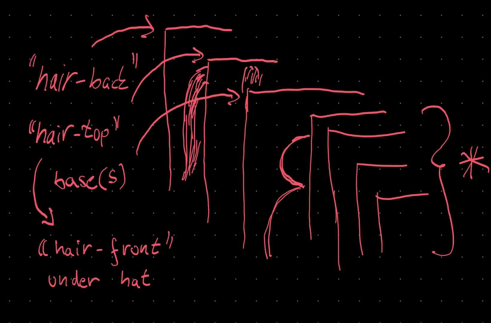

# Struktura avatara z pohledu grafika
Výsledný avatar vznikne složením jednotlivých vrstev dle složky [bigheads-parts](../src/svgs/bigheads-parts/). Všechny obrázky mají stejné rozměry s průhledným pozadím.
Složky odpovídají vrstvám a soubory v nich pak jednotlivým možnostem (ve skutečnosti i soubory v kořenovém adresáři jsou chápány jako vrstva s jednou možností). Soubory by mněly být pojmenovány dle vzoru `*.sub.svg` (hvězdička odpovídá pojmenování dané možnosti).

***
```
hat
  turban.sub.svg
  beanie.sub.svg
```
Ukázková struktura souborů odpovídající vrstvě **hat** s možnostmi **turban** a **beanie** („prázdnou” možnost lze dodefinovat, viz níže)
***
Kromně souborů lze možnosti vrstev/avatara přizpůsobit pomocí souboru [parts_initial.json](../src/svgs/parts_initial.json). Tento soubor obsahuje klíče `colors`, `safe_layers` a `parts`.

***
```json
{
    "colors": { 
        "hair": "#d96e27",
        "clothes": "#d67070",
        "hat": "#5bcaf0",
        "mouth": "#dd3e3e",
        "skin": "#fdd2b2"
    },
    "safe_layers": [
        "base",
        "eyes",
        "clothes",
        [ "facialhair", "eyebrow" ],
        "mouth",
        [ "nose" , "breasts", "hat", "glasses" ]
    ],
    "parts": {
        "glasses": [ "none" ],
        "breasts": [ "none" ],
        "eyebrow": [ "none" ],
        "facialhair": [ "none" ],
        "hair": { "none": { "front": true } },
        "hat": [ "none" ],
        "nose": [ "none" ]
    }
}
```
Ukázka možného nastavení souboru `parts_initial.json`
***


Pomocí `colors` se určují barvy, které se mají interpretovat jako dynamické (tj. ve výsledném avatarovi je lze změnit ve všech vrstvách) – jména klíčů by mněla odpovídat pojmenováním složek/souborů.

`safe_layers` reprezentuje řazení souborů/vrstev (bez vlasů, viz níže). Ve vnitřních polích jsou volitelné vrstvy: `"clothes", [ "facialhair", "eyebrow" ]` ⇒ obočí bude řazeno za oblečením a případně i za vousy (pokud si je uživatel zvolil).

***


Náčrt řazení vrstev

***

Vlasy jsou rozděleny na tři vrstvy: `back` (bude umístěna za `base`), `top` (také za `base`, při použití čepice se skryje) a `front` (umístěna před čepici – vrstva `hat`).

***
```
hair
  test-back.sub.svg
  test-top.sub.svg
  test-front.sub.svg
```
Ukázková struktura soborů reprezentující hypotetické vlasy zasahující do všech tří „oblastí”
***

Poslední klíč `parts` slouží jako základ všech výsledných možností. Tedy po zpracování `svg` souborů bude obsahovat všechny kombinace pro pšechny vrstvy (viz pro ukázku současný  [parts.json](../src/svgs/parts.json)).
Každopádně v [parts_initial.json](../src/svgs/parts_initial.json) tento klíč slouží k zaregistrování možnosti `"none"` vrstva nemusí být použita (↔avatar jej nemusí obsahovat). Všechny `"none"` možnosti by tedy měli odpovídat i volitelným vrstvám v klíči `safe_layers`.
